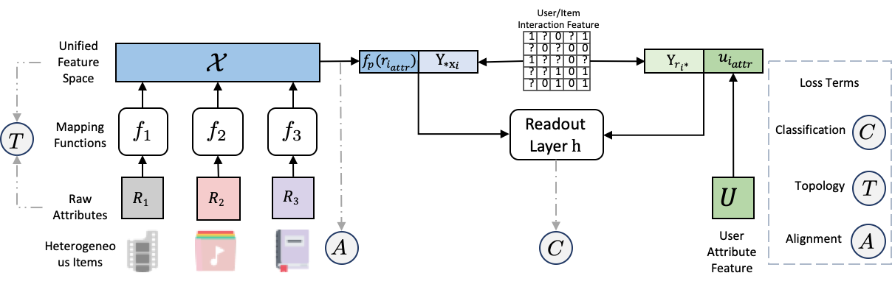

<p align="center">
  
  <br />
  <br />
</p>   

# HR  

Official implement of the paper 'Deep Unified Representation for Heterogeneous Recommendation'.  

## Dataset
In this paper, we use the Douban dataset stored in `data.tar.xz`. 
Please uncompress it and put it in the working directory.  

## Usage 


Before runing the code, please make sure that you have installed the dependency. You can install them with 
```
pip install -r requirements.txt 
``` 
Our code is tested on `python 3.7`.  

The next step is to prepare the configuration file. We provides the configurations of our proposed model and baselines in `configs` fold as examples. To reproduce the results report in our paper, one just need to change the path to your local path in the configuration.     

Then, you can run the program in one simple code. Take the DURation model as a example, there is a `duration.json` file in `configs`.  

## Models 

Official implement of the paper 'Deep Unified Representation for Heterogeneous Recommendation'.  
This project include servel common models for Heterogeneous Recommendation.   

## Dataset
In this project, we use the douban dataset stored in `data.zip`. Unzip it and put it in the working directory.  

## Usage 


Before runing the code, please make sure that you have installed the dependency. You can install them with 
```
pip install -r requirements.txt 
``` 
Our code is tested on `python 3.7`.  

The next step is to prepare the configuration file. We provides the configurations of our proposed model and baselines in `configs` fold as examples. To reproduce the results report in our paper, one just need  change the path to your local path in the configuration.     

Then, you can run the program in one simple code. Take the DURation model as a example, there is a `duration.json` file in `configs`.  

```
python train_hete.py duration
```

It is worth note that the configuration file must be put in `configs`. To test the homogeneous models, just replace `train_hete.py` with `train_homo.py`. The program will output the results on screen while save the log to a certain path.  

## Models

Currently, we support the following models:

+ **DeepMF**(2017): Deep Matrix Factorization Models for Recommender Systems
+ **FISM**(2013): Fism: factored item similarity models for top-n recommender systems.
+ **NAIS**(2018): Nais: Neural attentive item similarity model for recommendation. 
+ **DeepFM**(2017): DeepFM: a factorization-machine based neural network for CTR prediction
+ **xDeepFM**(2018): xdeepfm: Combining explicit and implicit feature interactions for recommender systems
+ **AFM**(2017): Attentional factorization machines: Learning the weight of feature interactions via attention networks
+ **DSSM**(2013): Learning deep structured semantic models for web search using clickthrough data
+ **Wide & Deep**(2016): Wide & deep learning for recommender systems
+ **autoInt**(2019): Autoint: Automatic feature interaction learning via selfattentive neural networks
+ **CCCFNet**(2012): Cross-domain collaboration recommendation
+ **DDTCDR**(2020): DDTCDR: Deep dual transfer cross domain recommendation
